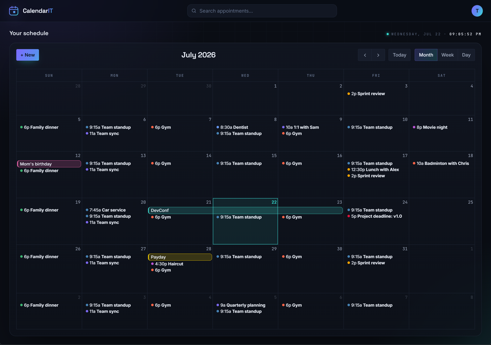
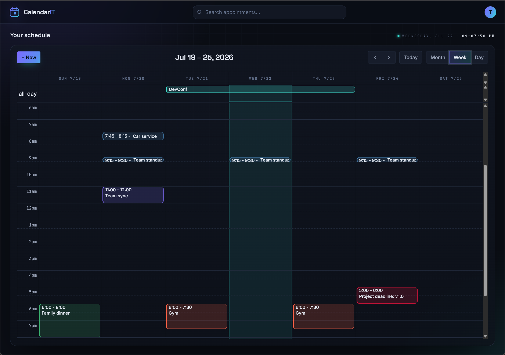

<p align="center">
  
</p>

<h1 align="center">CalendarIT</h1>

<p align="center"><b>A lightweight, modern calendar. It does what you want — and just that.</b></p>

---

No feeds to scroll, no AI to argue with, no "productivity suite" to sign up for.
CalendarIT is a self-hosted calendar you run on your own box: make events, get
reminded, sync to your phone. That's the whole pitch.

<p align="center">
  
</p>

---

[](https://buymeacoffee.com/spaceelephant)

## Why

Most calendar apps grew into something else - CalendarIT deliberately stays small:

- **Good-looking and simple.** Easy on the eyes, easy to use — the combination I
  couldn't find anywhere else.
- **Yours.** Self-hosted. Your events live in your database, on your server.
- **Standards-first.** Plain iCalendar (`.ics`) and CalDAV, so it talks to the tools you
  already have instead of locking you in.
- **Quiet.** A clean, dark, keyboard-friendly UI that gets out of the way.

If a feature doesn't help you keep track of your time, it doesn't belong here.

## What it does

- 📅 **Events, the fast way** — drag on the grid to create, double-click or right-click,
  drag to move or resize.
- 🗂️ **Multiple calendars** — split Personal from Work, toggle which are shown, move
  events between them; each syncs as its own calendar over CalDAV.
- 🔁 **Recurring events** — repeat rules with exceptions (RRULE).
- ⏰ **Reminders** — by email (browser Web Push is in progress).
- 🌍 **Time zones** — stored correctly, displayed in yours, DST-safe.
- 🎨 **Event colors** — pick a color per event; it syncs (via the iCalendar `COLOR`
  property) to clients that support it.
- 🔎 **Search** — find any appointment by title or location, keyboard-first.
- 📲 **Phone sync** — a built-in **CalDAV** server, so any CalDAV-capable app can
  subscribe and sync two-way.
- 📄 **iCal import / export** — pick which calendars to export; import into any
  calendar or a new one.
- 🔐 **Accounts** — email + password, JWT sessions with rotating refresh tokens.

<p align="center">
  
  <br />
  <sub>Week view — drag on the grid to create an appointment, drag events to move or resize them.</sub>
</p>

## Tech

| Layer     | Choice                                                           |
| --------- | --------------------------------------------------------------- |
| Frontend  | React + TypeScript + Vite, FullCalendar, TanStack Query          |
| API types | Generated from the backend's OpenAPI spec (`openapi-typescript`) |
| Backend   | ASP.NET Core (.NET 10) Web API, REST + OpenAPI                    |
| Auth      | ASP.NET Core Identity + JWT (access + rotating refresh)          |
| Data      | EF Core — **PostgreSQL** (primary), **SQLite** (fallback)        |
| Jobs      | Quartz.NET (reminders, housekeeping)                             |
| Logging   | Serilog behind `ILogger<T>` — themed console to stdout           |
| Packaging | Docker; runs behind your own reverse proxy (TLS terminated there)|

See [`ARCHITECTURE.md`](./ARCHITECTURE.md) for the full design and rationale.

## Quick start

### With Docker (closest to production)

```bash
cp .env.example .env
# set JWT_SIGNING_KEY (min 32 chars), e.g. openssl rand -base64 48
docker compose up --build
```

The app serves plain HTTP on `:8080`. Put your reverse proxy (Caddy / Traefik / nginx /
…) in front of it to terminate TLS — CalDAV clients effectively require HTTPS.

Running Unraid? Ready-made templates live in [`deploy/`](./deploy) —
`calendarit.unraid.xml` (plain) and `calendarit-traefik.unraid.xml` (with Traefik
labels preconfigured).

### Local development

```bash
# 1) backend  → http://localhost:5299
cd core/calendarITCore
dotnet run

# 2) frontend → http://localhost:5173  (proxies /api to the backend)
cd web
npm install
npm run dev
```

Regenerate the typed API client after changing the backend (with it running):

```bash
cd web && npm run gen:api
```

## Configuration

Everything is set through environment variables (12-factor):

| Variable                                  | Purpose                                          |
| ----------------------------------------- | ------------------------------------------------ |
| `DATABASE_PROVIDER`                       | `Postgres` (default in Docker) or `Sqlite`       |
| `POSTGRES_CONNECTION`                     | Npgsql connection string (Postgres only)         |
| `APPDATA_PATH`                            | Writable data dir (SQLite file, etc.) — `/appdata`|
| `JWT_SIGNING_KEY`                         | **Required.** ≥ 32 chars                         |
| `JWT_ISSUER` / `JWT_AUDIENCE`             | Token issuer / audience                          |
| `Serilog__MinimumLevel__Default`          | Log level (console-only, to stdout). Default `Information` |
| `SMTP_HOST` / `PORT` / `USER` / `PASSWORD` / `FROM` / `USE_SSL` | Email reminders. If `SMTP_HOST` is unset, reminders are logged instead of sent |
| `SMTP_*`, `VAPID_*`                        | Email + Web Push (reminders)                     |

## Project layout

```
core/calendarITCore/   ASP.NET Core solution (API host + Domain/Application/Infrastructure/CalDav)
web/                   React + Vite frontend
Dockerfile             Builds the SPA and serves it from the API
docker-compose.yml     App + PostgreSQL
ARCHITECTURE.md        Design decisions and roadmap
```

## Status

Under active development — built in phases (see `ARCHITECTURE.md` §10).

- ✅ Foundations: solution, logging, health checks, Docker skeleton
- ✅ Accounts & auth: Identity + JWT with rotating refresh tokens
- ✅ Web UI shell: calendar views, event editor (title, time, color, location, description)
- ✅ Events persist to the database — create / edit / delete / drag, scoped per user
- ✅ Recurring events (RRULE) with timezone/DST-correct expansion; delete a single
  occurrence or the whole series (editing a single occurrence is still on the list)
- ✅ iCal (.ics) import / export — round-trips title, time + zone, all-day, color, RRULE;
  export a selection of calendars, import into a chosen or new calendar
- ✅ Reminders — **email** via a Quartz.NET job (recurrence-aware, timezone-correct, dedup)
- ✅ CalDAV server — two-way sync with standard clients: discovery, ETags/CTag,
  calendar-query/multiget, create/edit/delete (no RFC 6578 sync-tokens yet — clients
  fall back to CTag polling; reminders don't map to VALARM yet)
- ✅ Multiple calendars — create/rename/delete in Settings, per-calendar visibility
  toggles, each exposed as its own CalDAV collection
- 🚧 Web Push reminders (VAPID + service worker)
- 🚧 Inviting guests — **outgoing invitations work**: connect your own email account
  (Settings → Email, password stored encrypted), add guests to an event, and they get a
  standard iMIP invite with Accept/Decline in their calendar; updates and cancellations
  are mailed too. Incoming replies / invitations (IMAP inbox scanning) are next — guest
  statuses don't update yet.
- ❌ Optimizing for small screens, does not look pretty currenty on the phone

Not everything above is wired end-to-end yet — check the roadmap before relying on a
feature.

## Support

CalendarIT is free and self-hosted — no accounts, no subscriptions. If it's useful to you and you'd
like to say thanks, you can [**buy me a coffee** ☕](https://buymeacoffee.com/spaceelephant). Much
appreciated, but never expected.

## License

Released under the [MIT](./LICENSE) © 2026 Richard Leopold. Free to use, modify, and distribute; just keep the copyright and license notice.
