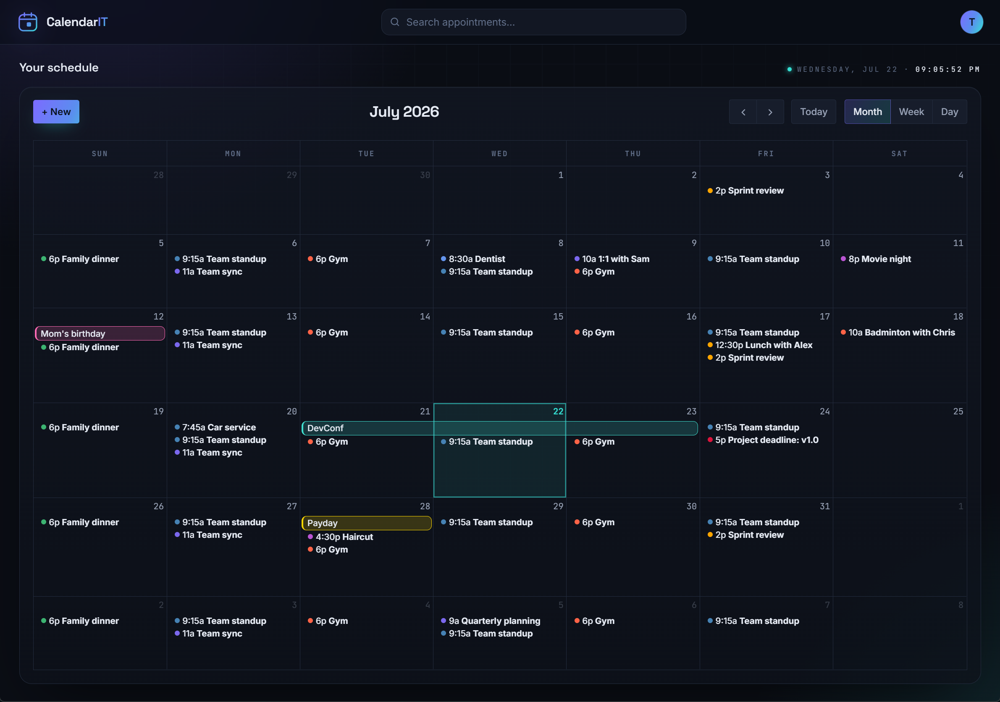
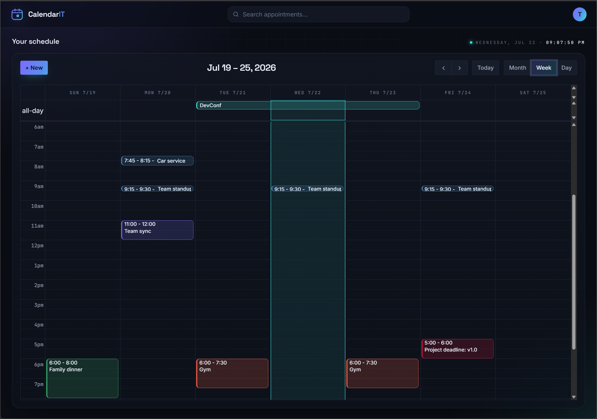
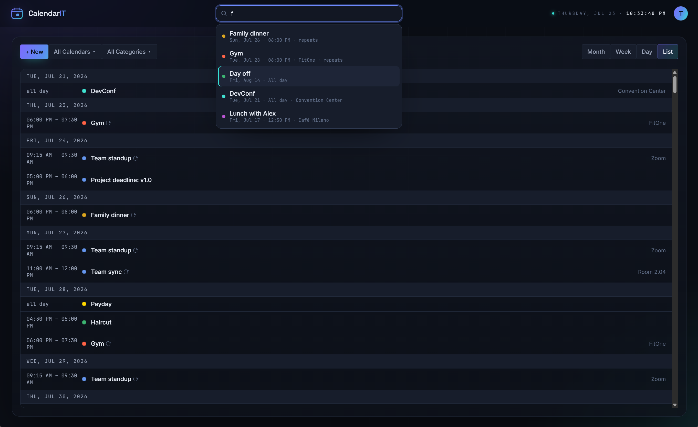

<p align="center">
  
</p>

<h1 align="center">CalendarIT</h1>

<p align="center"><b>A lightweight, modern calendar. It does what you want — and just that.</b></p>

---

No feeds to scroll, no AI to argue with, no "productivity suite" to sign up for.
CalendarIT is a self-hosted calendar that's just that — a beautiful, easy-to-use calendar.
Try it, you'll like it.

<p align="center">
  
</p>

---

[](https://buymeacoffee.com/spaceelephant)

## Why

Most calendar apps grew into something else - CalendarIT deliberately stays small:

- **Good-looking and simple.** Easy on the eyes, easy to use — the combination I
  couldn't find anywhere else.
- **Yours.** Self-hosted. Your events live in your database, on your server.
- **Standards-first.** Plain iCalendar (`.ics`) and CalDAV, so it talks to the tools you
  already have instead of locking you in.
- **Quiet.** A clean, dark, keyboard-friendly UI that gets out of the way.

If a feature doesn't help you keep track of your time, it doesn't belong here.

## What it does

- 📅 **Events, the fast way** — drag on the grid to create, double-click or right-click,
  drag to move or resize — with undo/redo for every change.
- 🗂️ **Multiple calendars** — split Personal from Work, toggle which are shown, move
  events between them; each syncs as its own calendar over CalDAV.
- 🔁 **Recurring events** — repeat rules with exceptions (RRULE).
- ⏰ **Reminders** — by email or browser notification (Web Push), set per appointment; they
  also sync to your phone as calendar alarms (VALARM) over CalDAV.
- 📱 **Made for phones too** — a responsive layout with a thumb-reachable toolbar, and swipe
  left/right to page between views.
- 🌍 **Time zones** — stored correctly, displayed in yours, DST-safe.
- 🎨 **Categories** — named colors (Work, Family, …) managed in Settings; recolor a
  category and every appointment in it follows. Syncs via the iCalendar `CATEGORIES` +
  `COLOR` properties; a color picked on the phone maps back to the nearest category.
- 🔎 **Search** — find any appointment by title or location, keyboard-first.
- 📲 **Phone sync** — a built-in **CalDAV** server, so any CalDAV-capable app can
  subscribe and sync two-way.
- 📄 **iCal import / export** — pick which calendars to export; import into any
  calendar or a new one.
- 🔐 **Accounts** — email + password, JWT sessions with rotating refresh tokens, password change
  and self-service reset by email, and a switch to close sign-up.

<table>
  <tr>
    <td width="50%"><a href="docs/ScreenShot_Week.png"></a></td>
    <td width="50%"><a href="docs/ScreenShot_List_Search.png"></a></td>
  </tr>
  <tr>
    <td align="center"><sub><b>Week View</b>.</sub></td>
    <td align="center"><sub><b>List View</b>, and search for appointments (works in all views).</sub></td>
  </tr>
</table>

## Quick start

### With Docker

Copy the env template and set a signing key:

```bash
cp .env.example .env
# set JWT_SIGNING_KEY (min 32 chars), e.g. openssl rand -base64 48
```

A minimal `docker-compose.yml` — one container on the built-in SQLite database, no separate DB
needed (the repo ships a fuller, commented version that uses PostgreSQL):

```yaml
services:
  app:
    build: .                       # or an image you've built/pushed
    restart: unless-stopped
    environment:
      # DATABASE_PROVIDER defaults to Sqlite — no separate database service required.
      APPDATA_PATH: /appdata       # SQLite file, avatars, and auto-generated keys live here
      JWT_SIGNING_KEY: ${JWT_SIGNING_KEY:?set JWT_SIGNING_KEY in .env}   # required — min 32 chars
      # Optional extras (see the Configuration table below): DISABLE_REGISTRATION,
      # PUBLIC_BASE_URL (for password-reset emails), FORWARDED_PROXY_HOPS, VAPID_*, …
    volumes:
      - appdata:/appdata
    # The app serves plain HTTP on :8080 and is deliberately NOT published to the host — put a
    # TLS-terminating reverse proxy in front and point it at http://app:8080 (CalDAV clients
    # effectively require HTTPS). To reach it directly from the host, publish to loopback only:
    #   ports: ["127.0.0.1:8080:8080"]

volumes:
  appdata:
```

Then start it:

```bash
docker compose up --build      # add -d to run in the background
```

Running Unraid? Ready-made templates live in [`deploy/`](./deploy) —
`calendarit.unraid.xml` (plain) and `calendarit-traefik.unraid.xml` (with Traefik
labels preconfigured).

### Local development

```bash
# 1) backend  → http://localhost:5299
cd core/calendarITCore
dotnet run

# 2) frontend → http://localhost:5173  (proxies /api to the backend)
cd web
npm install
npm run dev
```

Regenerate the typed API client after changing the backend (with it running):

```bash
cd web && npm run gen:api
```

## Configuration

Everything is set through environment variables (12-factor):

| Variable                                  | Purpose                                          |
| ----------------------------------------- | ------------------------------------------------ |
| `DATABASE_PROVIDER`                       | `Postgres` (default in Docker) or `Sqlite`       |
| `POSTGRES_CONNECTION`                     | Npgsql connection string (Postgres only)         |
| `APPDATA_PATH`                            | Writable data dir (SQLite file, etc.) — `/appdata`|
| `JWT_SIGNING_KEY`                         | **Required.** ≥ 32 chars                         |
| `JWT_ISSUER` / `JWT_AUDIENCE`             | Token issuer / audience                          |
| `DISABLE_REGISTRATION`                    | `true` closes public sign-up. Existing accounts are unaffected |
| `PUBLIC_BASE_URL`                         | **Required for password reset.** Origin used in reset links, e.g. `https://calendar.example.com` |
| `AUTH_RATE_LIMIT_PER_MINUTE`              | Auth requests allowed per client IP per minute. Default `20` |
| `FORWARDED_PROXY_HOPS`                    | How many `X-Forwarded-For` hops to trust. Default `1` — see below |
| `Serilog__MinimumLevel__Default`          | Log level (console-only, to stdout). Default `Information` |
| `VAPID_PUBLIC_KEY` / `VAPID_PRIVATE_KEY`  | Web Push signing keys. **Optional** — auto-generated and persisted under `APPDATA_PATH` if unset. Set both to pin them across deployments |
| `VAPID_SUBJECT`                           | Contact URI in push messages, e.g. `mailto:admin@example.com`. Default `mailto:admin@calendarit.local` |

> **Set `PUBLIC_BASE_URL` if you want self-service password reset.** The address in a reset
> link is deliberately never read from the request: `Host` is just a header, and the
> forgot-password endpoint is anonymous, so taking it from there would let anyone have a
> genuine reset link mailed to a host they control. With it unset, reset links aren't sent and
> the server logs why — sign-in, and everything else, is unaffected.

> **Set `FORWARDED_PROXY_HOPS` to match your setup.** The app trusts exactly this many
> proxies when reading the client's IP, which is what the auth rate limit and your logs key
> on. Count the proxies in front of the API: **1** when your reverse proxy talks to the app
> directly (the `docker-compose` setup), **2** for the single-container image, where your
> proxy sits in front of the container's own nginx. Too low and every client looks like one
> address; too high and clients can forge their own.

> **Repeated bad passwords lock an account** for 15 minutes after 10 failures — this covers
> the web login and CalDAV alike, since both check the same credentials. Worth knowing if you
> change your password: a phone still syncing with the old one will keep retrying and can lock
> you out, so update it in your CalDAV client too. (Completing a password reset lifts a lockout.)

> **Close sign-up once everyone has an account.** Set `DISABLE_REGISTRATION=true` — your instance
> is reachable by anyone who knows the address, because that is what makes phone sync work.
> Existing accounts keep working and the Register tab disappears from the sign-in screen.

### Forgot your password?

The sign-in screen has a **Forgot your password?** link that emails a single-use link, valid for
two hours. Because CalendarIT has no mail relay of its own, that email is sent through **your own
connected mail account** (Settings → Email) — set a **Reminder From address** there if you'd rather
it came from `noreply@` than your personal address.

If the account has no working mail account, the link can't be emailed, so the server **writes it to
its log** instead:

```bash
docker logs <container> | grep password-reset
```

That keeps a self-hosted instance recoverable without database surgery. It also means anyone who
can read your container logs can take over an account — which is already true of anyone who can
read your database, so it grants no new access, but it is worth knowing.

> **Email needs no environment variables.** Invitations and reminders are sent through each
> user's own mail account, connected in-app under **Settings → Email** (SMTP + IMAP, password
> stored encrypted). Users without a connected account simply get their reminders logged
> instead of emailed.

> **Browser notifications are opt-in per browser.** Choose **Browser** on an appointment's
> reminder (or flip the toggle in **Settings → General**) and allow the permission prompt. They
> arrive even when CalendarIT isn't open, and need a secure origin — HTTPS in production, or
> `localhost` in dev. No keys to configure: VAPID keys are generated automatically on first run
> (set `VAPID_*` only if you want to pin them across deployments).

## Project layout

```
core/calendarITCore/   ASP.NET Core solution (API host + Domain/Application/Infrastructure/CalDav)
web/                   React + Vite frontend
Dockerfile             Builds the SPA and serves it from the API
docker-compose.yml     App + PostgreSQL
ARCHITECTURE.md        Design decisions and roadmap
```

## Status

Under active development — built in phases (see `ARCHITECTURE.md` §10).

- ✅ Foundations: solution, logging, health checks, Docker skeleton
- ✅ Accounts & auth: Identity + JWT with rotating refresh tokens
- ✅ Web UI shell: calendar views, event editor (title, time, color, location, description)
- ✅ Events persist to the database — create / edit / delete / drag, scoped per user, with
  undo/redo
- ✅ Recurring events (RRULE) with timezone/DST-correct expansion; delete a single
  occurrence or the whole series (editing a single occurrence is still on the list)
- ✅ iCal (.ics) import / export — round-trips title, time + zone, all-day, color, RRULE;
  export a selection of calendars, import into a chosen or new calendar
- ✅ Reminders — **email** and **browser notifications (Web Push)** via a Quartz.NET job
  (recurrence-aware, timezone-correct, dedup); the channel is chosen per reminder on the event
- ✅ CalDAV server — two-way sync with standard clients: discovery, ETags/CTag,
  calendar-query/multiget, create/edit/delete, reminders as VALARM both ways (no RFC 6578
  sync-tokens yet — clients fall back to CTag polling)
- ✅ Multiple calendars — create/rename/delete in Settings, per-calendar visibility
  toggles, each exposed as its own CalDAV collection
- ✅ Categories — events take their color from a named category (managed in Settings);
  existing per-event colors were auto-migrated into categories on first startup
- ✅ Mobile — responsive phone layout, a thumb-reachable bottom toolbar, and swipe left/right
  to page between views (visual polish still ongoing)
- ✅ Inviting guests — connect your own email account (Settings → Email, password stored
  encrypted), add guests to an event, and they get a standard iMIP invite with Accept/Decline in
  their calendar; updates and cancellations are mailed too.
  - **Guest replies sync back** — with IMAP configured, your inbox is scanned on a configurable
    interval (default 5 min) and each Accept/Decline/Tentative updates the guest's status on the
    event (read-only, idempotent — messages are never modified).
  - **Receiving invitations** — the same scan picks up invitations others email you (iMIP
    REQUEST), adds them as pending (dashed outline + ✉), and removes them when the organizer cancels.
  - **Responding** — open a received invitation and Accept / Maybe / Decline; your status is
    saved and an iMIP REPLY is emailed back to the organizer.
  - Incoming messages must genuinely come from the organizer (or guest) the invitation names, so
    nobody can put events on your calendar under someone else's name — mismatches are logged and ignored.

A few edges are still rough (noted above and in the roadmap), but the features listed here work
end-to-end.

## Support

CalendarIT is free and self-hosted — no accounts, no subscriptions. If it's useful to you and you'd
like to say thanks, you can [**buy me a coffee** ☕](https://buymeacoffee.com/spaceelephant). Much
appreciated, but never expected.

## License

Released under the [MIT](./LICENSE) © 2026 Richy Leopold. Free to use, modify, and distribute; just keep the copyright and license notice.
